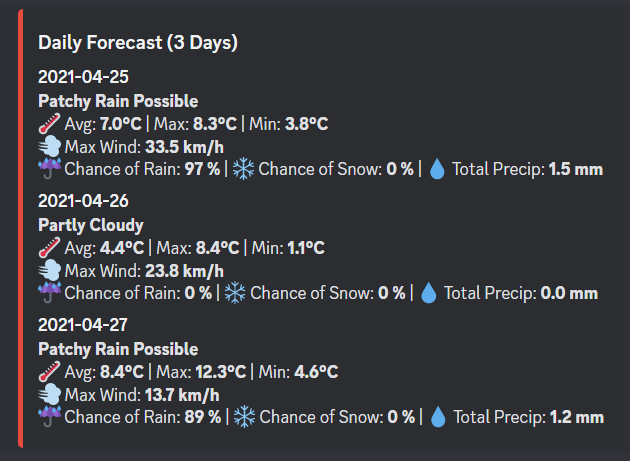

# WeatherBuddy
All-in-One Weather Bot for Discord

Through this bot, users can find current weather data as well as various forecasts straight from their Discord chats. Users use the built in Discord reaction system to navigate the forecast pages. 

Use ~weather (location) to land on the navigation page!

Navigation Page

Click ⏰ for hourly forecast and 📆 for weekly!

Hourly Forecast

